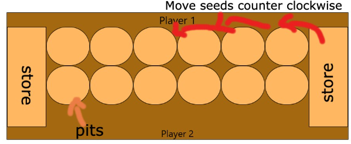

# Mancala User Manual
## Software Manual, May 2022
Link to Google Doc version: https://docs.google.com/document/d/1igIPIf_IOhAO0LVzAOQxO7cxVbnZ1o3sjCY6uvKpoRU/edit?usp=sharing

### Objective of the Game
The objective of Mancala is to capture as many seeds as possible before the game ends. The player with the greater number of captured seeds in their store at the end of the game wins. Seeds are captured through the redistribution process (hereafter referred to as sowing) of pieces around the board.
### How to Play
Players pick up and move the seeds in one of the pits nearest to them in a counter clockwise direction around the board placing a seed in each hole that is passed over. The store on your right belongs to you; this is where you keep the seeds you win. Players can win seeds by dropping seeds in their store as they pass over it or by capturing the opponent’s seeds. 

### Starting the Game
On a turn, a player picks up all the seeds in one pit and “sows” them to the right, placing one seed in each of the pits along the way. If you come to your store, then add a seed to your store and continue. You may end up putting seeds in your opponent’s pits along the way. Play alternates back and forth, with opponents picking up the seeds in one of their pits and distributing them one at a time into the pits on the right, beginning in the pit immediately to the right.
### Winning
The process of sowing and capturing continues until one player runs out of stones to sow. When one player is unable to make a move, the game is over, and the player with the greater number of captured seeds in their store wins. The game may also end when few enough seeds remain in the pits to make continued play pointless. Both players can agree to abandon play at that point. The player with the greater number of captured seeds in their store wins. 
### Mancala Menus
The Mancala program offers several options which can help add variety to the game and make playing more fun. These options are accessible through the menu bar at the top of the screen and will be explained in detail.
#### Rounds
This option allows you to set a number of rounds that you would like to play, this only works with positive whole numbers (1, 2, 3, etc.)
#### Timer
This option allows the user to see the amount of time elapses since the game begun.
#### Number of Holes
This option allows the user to set the amount of holes on each side of the board, each increment sets the amount of holes on both sides of the board.
#### Game Type
Allows the user to select between multiplayer and a bot.
